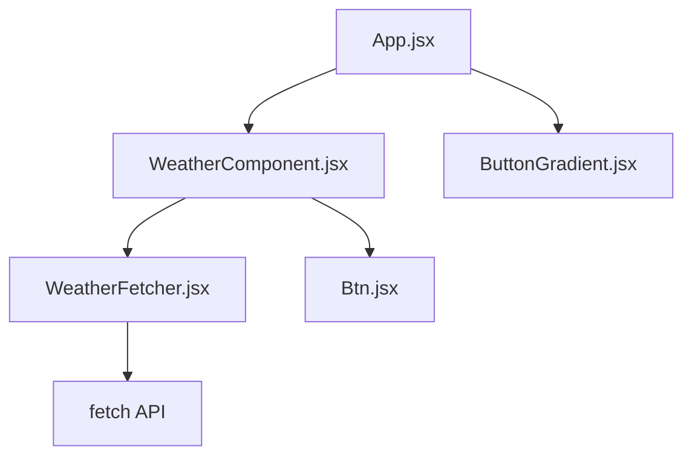
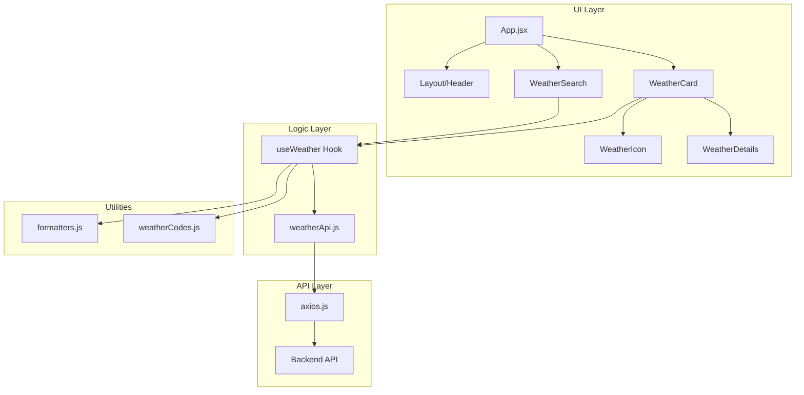

# Weather-CLI UI Refactoring Blueprint

## Executive Summary

This blueprint outlines a comprehensive refactoring plan to transform the Weather-CLI student project into a professional, portfolio-ready application with modern architecture, DRY principles, and scalable design.

---

## Current State Analysis

### Issues Identified

| File                                                                   | Problem                                       | Impact                               |
| ---------------------------------------------------------------------- | --------------------------------------------- | ------------------------------------ |
| [`WeatherFetcher.jsx`](frontend/src/components/WeatherFetcher.jsx)     | Logic + UI coupled in one component           | Not reusable, hard to test           |
| [`WeatherComponent.jsx`](frontend/src/components/WeatherComponent.jsx) | Mixed concerns: state, UI, and business logic | Violates SRP                         |
| [`App.jsx`](frontend/src/App.jsx)                                      | Hardcoded gradient styles                     | Not themeable                        |
| [`Btn.jsx`](frontend/src/components/Btn.jsx)                           | Uses custom SVG gradient system               | Inconsistent with Tailwind           |
| No API layer                                                           | Direct `fetch` calls in components            | No caching, no error standardization |
| No custom hooks                                                        | State logic duplicated                        | Not DRY                              |
| No type safety                                                         | No TypeScript or PropTypes validation         | Runtime errors                       |

### Current Architecture



---

## Target Architecture

### Proposed Directory Structure

```plaintext
frontend/src/
├── api/                          # API Layer
│   ├── axios.js                  # Axios instance with interceptors
│   └── weatherApi.js             # Weather-specific API functions
│
├── components/
│   ├── ui/                       # Atomic UI components
│   │   ├── Button.jsx            # Reusable button
│   │   ├── Input.jsx             # Reusable input
│   │   ├── Card.jsx              # Glass-morphism card
│   │   ├── Skeleton.jsx          # Loading skeleton
│   │   └── index.js              # Barrel export
│   │
│   ├── weather/                  # Feature components
│   │   ├── WeatherCard.jsx       # Main weather display
│   │   ├── WeatherSearch.jsx     # Search form
│   │   ├── WeatherDetails.jsx    # Detailed weather info
│   │   ├── WeatherIcon.jsx       # Dynamic weather icons
│   │   └── index.js              # Barrel export
│   │
│   └── layout/                   # Layout components
│       ├── Header.jsx            # App header
│       ├── Container.jsx         # Responsive container
│       ├── Background.jsx        # Dynamic background
│       └── index.js              # Barrel export
│
├── hooks/                        # Custom React hooks
│   ├── useWeather.js             # Weather data fetching
│   ├── useLocalStorage.js        # Persist preferences
│   └── index.js                  # Barrel export
│
├── utils/                        # Utility functions
│   ├── formatters.js             # Temperature, date formatters
│   ├── weatherCodes.js           # Weather code mappings
│   └── constants.js              # App constants
│
├── styles/                       # Global styles
│   └── animations.css            # Custom animations
│
├── App.jsx                       # Main app component
├── main.jsx                      # Entry point
└── index.css                     # Tailwind imports
```

### Target Architecture Diagram



---

## Phase-by-Phase Implementation Plan

### Phase 1: Directory Restructuring

**Goal**: Establish scalable folder architecture

**Tasks**:

1. Create new directory structure under `src/`
2. Create barrel export files for each module
3. Move existing assets to appropriate locations
4. No code changes yet - just structure preparation

**Files to Create**:

- `src/api/` directory
- `src/hooks/` directory
- `src/utils/` directory
- `src/components/ui/` directory
- `src/components/weather/` directory
- `src/components/layout/` directory
- `src/styles/` directory

---

### Phase 2: Logic Abstraction

**Goal**: Separate business logic from UI components

**Tasks**:

#### 2.1 Create API Service Layer

Create `src/api/axios.js`:

```javascript
import axios from "axios";

const api = axios.create({
  baseURL: import.meta.env.VITE_API_BASE_URL,
  timeout: 10000,
});

// Request interceptor
api.interceptors.request.use(
  (config) => {
    // Add loading state, auth tokens, etc.
    return config;
  },
  (error) => Promise.reject(error),
);

// Response interceptor
api.interceptors.response.use(
  (response) => response.data,
  (error) => {
    // Standardize error messages
    const message = error.response?.data?.message || error.message;
    return Promise.reject(new Error(message));
  },
);

export default api;
```

Create `src/api/weatherApi.js`:

```javascript
import api from "./axios";

export const weatherApi = {
  getWeather: (city, unit = "metric") =>
    api.get(`/weather/${city}`, { params: { unit } }),
};
```

#### 2.2 Create Custom Hooks

Create `src/hooks/useWeather.js`:

```javascript
import { useState, useCallback } from "react";
import { weatherApi } from "../api/weatherApi";

export const useWeather = () => {
  const [weather, setWeather] = useState(null);
  const [loading, setLoading] = useState(false);
  const [error, setError] = useState(null);

  const fetchWeather = useCallback(async (city, unit = "metric") => {
    if (!city?.trim()) return;

    setLoading(true);
    setError(null);

    try {
      const data = await weatherApi.getWeather(city, unit);
      setWeather(data);
    } catch (err) {
      setError(err.message);
    } finally {
      setLoading(false);
    }
  }, []);

  const clearWeather = useCallback(() => {
    setWeather(null);
    setError(null);
  }, []);

  return { weather, loading, error, fetchWeather, clearWeather };
};
```

Create `src/hooks/useLocalStorage.js`:

```javascript
import { useState, useEffect } from "react";

export const useLocalStorage = (key, initialValue) => {
  const [storedValue, setStoredValue] = useState(() => {
    try {
      const item = localStorage.getItem(key);
      return item ? JSON.parse(item) : initialValue;
    } catch {
      return initialValue;
    }
  });

  useEffect(() => {
    try {
      localStorage.setItem(key, JSON.stringify(storedValue));
    } catch (error) {
      console.error("Error saving to localStorage:", error);
    }
  }, [key, storedValue]);

  return [storedValue, setStoredValue];
};
```

#### 2.3 Create Utility Functions

Create `src/utils/formatters.js`:

```javascript
export const formatTemperature = (temp, unit = "C") => {
  return `${Math.round(temp)}°${unit}`;
};

export const formatTime = (timestamp) => {
  return new Date(timestamp * 1000).toLocaleTimeString("en-US", {
    hour: "2-digit",
    minute: "2-digit",
  });
};

export const formatVisibility = (meters) => {
  return `${(meters / 1000).toFixed(1)} km`;
};

export const formatWindSpeed = (speed, unit = "m/s") => {
  return `${speed} ${unit}`;
};
```

Create `src/utils/weatherCodes.js`:

```javascript
// OpenWeatherMap weather code mappings
export const weatherCodeMap = {
  // Thunderstorm
  "2xx": {
    icon: "thunderstorm",
    gradient: "from-gray-800 via-purple-900 to-gray-900",
  },
  // Drizzle
  "3xx": {
    icon: "drizzle",
    gradient: "from-gray-600 via-blue-800 to-gray-700",
  },
  // Rain
  "5xx": { icon: "rain", gradient: "from-blue-900 via-gray-800 to-blue-900" },
  // Snow
  "6xx": { icon: "snow", gradient: "from-blue-200 via-white to-gray-300" },
  // Atmosphere (fog, mist, etc.)
  "7xx": { icon: "fog", gradient: "from-gray-400 via-gray-500 to-gray-600" },
  // Clear
  800: { icon: "clear", gradient: "from-blue-400 via-blue-500 to-blue-600" },
  // Clouds
  "80x": { icon: "clouds", gradient: "from-gray-500 via-gray-600 to-gray-700" },
};

export const getWeatherStyle = (code) => {
  const codeStr = String(code);
  if (codeStr === "800") return weatherCodeMap["800"];

  const groupCode = codeStr.slice(0, 1) + "xx";
  return weatherCodeMap[groupCode] || weatherCodeMap["80x"];
};
```

---

### Phase 3: Component Atomization

**Goal**: Break monolithic components into reusable, single-responsibility components

**Tasks**:

#### 3.1 Create UI Components

Create `src/components/ui/Button.jsx`:

```javascript
import PropTypes from "prop-types";

const variants = {
  primary: "bg-blue-600 hover:bg-blue-700 text-white",
  secondary: "bg-gray-600 hover:bg-gray-700 text-white",
  ghost: "bg-transparent hover:bg-white/10 text-white border border-white/20",
};

const sizes = {
  sm: "px-3 py-1.5 text-sm",
  md: "px-4 py-2 text-base",
  lg: "px-6 py-3 text-lg",
};

export const Button = ({
  children,
  variant = "primary",
  size = "md",
  className = "",
  ...props
}) => {
  return (
    <button
      className={`
        rounded-lg font-medium transition-all duration-300
        ${variants[variant]} ${sizes[size]} ${className}
      `}
      {...props}
    >
      {children}
    </button>
  );
};

Button.propTypes = {
  children: PropTypes.node.isRequired,
  variant: PropTypes.oneOf(["primary", "secondary", "ghost"]),
  size: PropTypes.oneOf(["sm", "md", "lg"]),
  className: PropTypes.string,
};
```

Create `src/components/ui/Input.jsx`:

```javascript
import PropTypes from "prop-types";

export const Input = ({ label, error, className = "", ...props }) => {
  return (
    <div className="flex flex-col gap-1">
      {label && <label className="text-sm text-gray-300">{label}</label>}
      <input
        className={`
          px-4 py-2 rounded-lg
          bg-white/10 backdrop-blur-sm
          border border-white/20
          text-white placeholder-gray-400
          focus:outline-none focus:ring-2 focus:ring-blue-500
          transition-all duration-300
          ${error ? "border-red-500" : ""}
          ${className}
        `}
        {...props}
      />
      {error && <span className="text-sm text-red-400">{error}</span>}
    </div>
  );
};

Input.propTypes = {
  label: PropTypes.string,
  error: PropTypes.string,
  className: PropTypes.string,
};
```

Create `src/components/ui/Card.jsx`:

```javascript
import PropTypes from "prop-types";

export const Card = ({ children, className = "", ...props }) => {
  return (
    <div
      className={`
        bg-white/10 backdrop-blur-md
        border border-white/20
        rounded-2xl shadow-xl
        p-6
        ${className}
      `}
      {...props}
    >
      {children}
    </div>
  );
};

Card.propTypes = {
  children: PropTypes.node.isRequired,
  className: PropTypes.string,
};
```

Create `src/components/ui/Skeleton.jsx`:

```javascript
import PropTypes from "prop-types";

export const Skeleton = ({ className = "" }) => {
  return (
    <div
      className={`
        animate-pulse bg-white/20 rounded-lg
        ${className}
      `}
    />
  );
};

Skeleton.propTypes = {
  className: PropTypes.string,
};
```

#### 3.2 Create Weather Components

Create `src/components/weather/WeatherCard.jsx`:

```javascript
import PropTypes from "prop-types";
import { Card } from "../ui/Card";
import { WeatherIcon } from "./WeatherIcon";
import { WeatherDetails } from "./WeatherDetails";
import { formatTemperature } from "../../utils/formatters";

export const WeatherCard = ({ weather }) => {
  if (!weather) return null;

  return (
    <Card className="animate-fade-in">
      <div className="flex flex-col md:flex-row items-center gap-6">
        {/* Main Weather Display */}
        <div className="flex items-center gap-4">
          <WeatherIcon conditions={weather.conditions} size="lg" />
          <div>
            <h2 className="text-3xl font-bold text-white">
              {weather.city}, {weather.country}
            </h2>
            <p className="text-5xl font-light text-white mt-2">
              {formatTemperature(weather.temperature)}
            </p>
            <p className="text-lg text-gray-300 capitalize mt-1">
              {weather.conditions}
            </p>
          </div>
        </div>

        {/* Weather Details Grid */}
        <WeatherDetails weather={weather} />
      </div>
    </Card>
  );
};

WeatherCard.propTypes = {
  weather: PropTypes.shape({
    city: PropTypes.string,
    country: PropTypes.string,
    temperature: PropTypes.string,
    conditions: PropTypes.string,
  }).isRequired,
};
```

Create `src/components/weather/WeatherSearch.jsx`:

```javascript
import PropTypes from "prop-types";
import { useState } from "react";
import { Input } from "../ui/Input";
import { Button } from "../ui/Button";

export const WeatherSearch = ({ onSearch, loading }) => {
  const [city, setCity] = useState("");

  const handleSubmit = (e) => {
    e.preventDefault();
    if (city.trim()) {
      onSearch(city.trim());
    }
  };

  return (
    <form onSubmit={handleSubmit} className="flex gap-2">
      <Input
        type="text"
        placeholder="Enter city name..."
        value={city}
        onChange={(e) => setCity(e.target.value)}
        className="flex-1"
      />
      <Button type="submit" disabled={loading}>
        {loading ? "Searching..." : "Search"}
      </Button>
    </form>
  );
};

WeatherSearch.propTypes = {
  onSearch: PropTypes.func.isRequired,
  loading: PropTypes.bool,
};
```

#### 3.3 Create Layout Components

Create `src/components/layout/Background.jsx`:

```javascript
import PropTypes from "prop-types";
import { getWeatherStyle } from "../../utils/weatherCodes";

export const Background = ({ weatherCode, children }) => {
  const style = weatherCode ? getWeatherStyle(weatherCode) : null;
  const gradient =
    style?.gradient || "from-blue-900 via-purple-900 to-pink-900";

  return (
    <div
      className={`
      min-h-screen
      bg-gradient-to-br ${gradient}
      transition-all duration-1000
    `}
    >
      {children}
    </div>
  );
};

Background.propTypes = {
  weatherCode: PropTypes.number,
  children: PropTypes.node.isRequired,
};
```

---

### Phase 4: UI/UX Modernization

**Goal**: Implement modern 2026 design aesthetics

**Design System**:

#### Color Palette

```css
/* Add to index.css @theme block */
--color-glass-bg: rgba(255, 255, 255, 0.1);
--color-glass-border: rgba(255, 255, 255, 0.2);
--color-text-primary: rgba(255, 255, 255, 0.95);
--color-text-secondary: rgba(255, 255, 255, 0.7);
--color-accent: #3b82f6;
--color-accent-hover: #2563eb;
```

#### Glassmorphism Effects

```css
/* Glass card effect */
.glass {
  background: rgba(255, 255, 255, 0.1);
  backdrop-filter: blur(10px);
  border: 1px solid rgba(255, 255, 255, 0.2);
  box-shadow: 0 8px 32px rgba(0, 0, 0, 0.2);
}
```

#### Animations

```css
/* Add to styles/animations.css */
@keyframes fade-in {
  from {
    opacity: 0;
    transform: translateY(10px);
  }
  to {
    opacity: 1;
    transform: translateY(0);
  }
}

@keyframes slide-up {
  from {
    opacity: 0;
    transform: translateY(20px);
  }
  to {
    opacity: 1;
    transform: translateY(0);
  }
}

.animate-fade-in {
  animation: fade-in 0.5s ease-out forwards;
}

.animate-slide-up {
  animation: slide-up 0.6s ease-out forwards;
}
```

**Tasks**:

1. Update [`index.css`](frontend/src/index.css) with new theme variables
2. Create animation CSS file
3. Implement dynamic background based on weather
4. Add micro-interactions with CSS transitions
5. Ensure responsive design for all components

---

### Phase 5: Testing & Documentation

**Goal**: Ensure code quality and maintainability

**Tasks**:

#### 5.1 Add Tests

- Unit tests for utility functions
- Hook tests for `useWeather`
- Component tests for UI components

#### 5.2 Update Documentation

- Update [`README.md`](README.md) with new architecture
- Add JSDoc comments to all functions
- Create component storybook (optional)

#### 5.3 Add Error Boundaries

```javascript
// src/components/ErrorBoundary.jsx
import { Component } from "react";

export class ErrorBoundary extends Component {
  state = { hasError: false };

  static getDerivedStateFromError() {
    return { hasError: true };
  }

  render() {
    if (this.state.hasError) {
      return (
        <div className="p-4 text-center">
          <h2>Something went wrong.</h2>
          <button onClick={() => window.location.reload()}>Refresh Page</button>
        </div>
      );
    }
    return this.props.children;
  }
}
```

---

## Dependencies to Add

```json
{
  "dependencies": {
    "axios": "^1.6.0"
  },
  "devDependencies": {
    "@testing-library/react": "^14.0.0",
    "@testing-library/jest-dom": "^6.0.0",
    "vitest": "^1.0.0"
  }
}
```

---

## Migration Strategy

1. **Parallel Development**: Create new structure alongside existing code
2. **Incremental Migration**: Migrate one component at a time
3. **Feature Flags**: Use flags to switch between old/new components
4. **Testing at Each Step**: Verify functionality after each migration

---

## Success Metrics

| Metric           | Current | Target    |
| ---------------- | ------- | --------- |
| Component count  | 3       | 15+       |
| Reusable hooks   | 0       | 2+        |
| API abstraction  | None    | Full      |
| Test coverage    | 0%      | 70%+      |
| Bundle size      | TBD     | Optimized |
| Lighthouse score | TBD     | 90+       |

---

## Next Steps

1. **Review this blueprint** with the team
2. **Prioritize phases** based on project timeline
3. **Begin Phase 1** - Directory restructuring
4. **Set up testing infrastructure** early

---

_This blueprint is a living document. Update as requirements evolve._
